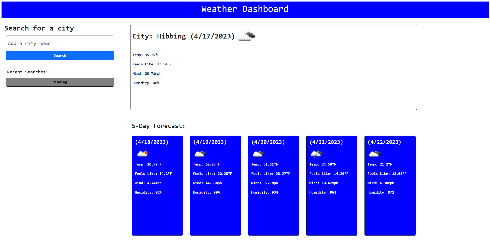

# Weather-Dashboard

## Description
This week we were challenged to make a weather dashboard. With the dashboard we had to use a weather API to to get data for a user input city. We had to first pass in coordinates instead of just a city name to get weather data. This was definitely the most challenging assignment that we've had so far and I learned a lot from it. Although I couldnt figure out a way to loop through the days for the 5 day forecast the code still functions properly.

## Usage

Click [link](https://n8trask.github.io/Weather-Dashboard/) to visit functional weather dashboard

